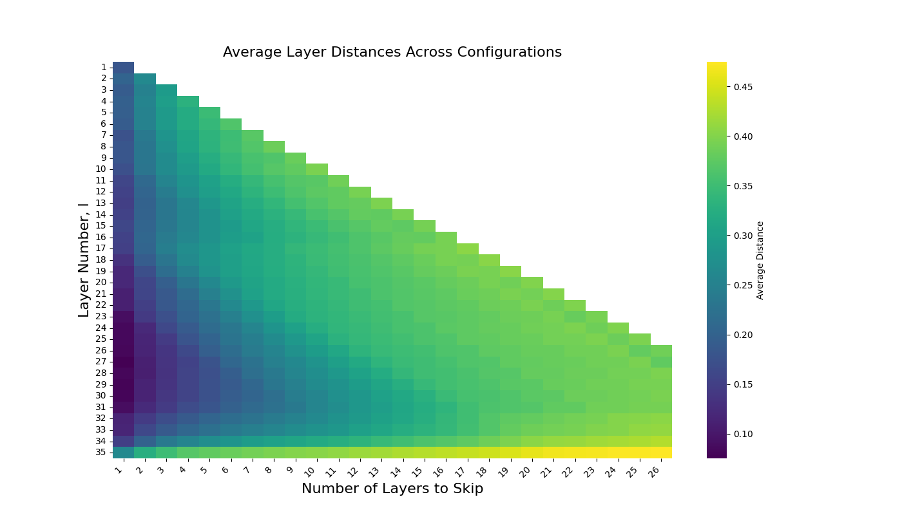
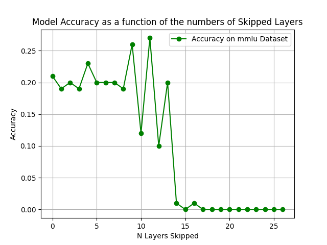

# Project: **Short‑LLM: Pruning Redundant Layers in Large Language Models**

## Introduction  

This project investigates layer redundancy in Large Language Models (LLMs) and explores pruning techniques based on the ideas in **“The Unreasonable Ineffectiveness of the Deep Layers”** [1] and **“ShortGPT: Layers in Large Language Models are More Redundant Than You Expect”** [2].  
Because of the residual connections in Transformer architectures [3], many deep layers can often be removed with limited loss in performance.

We replicate and apply these pruning techniques to two open‑weight models [2]:

* **Gemma 3‑1b‑it**  
* **Mistral‑8B‑Instruct‑2410**  *(labelled “Ministral” in some slides)*  

---

## Methodology  

### 1 · Layer‑Similarity Calculation  
Layer pairs are compared with **angular distance** between the input to layer `l` and the input to layer `l + n` (i.e. the output of a block of size `n`) [4]:

$$d\!\left(x^{(l)},x^{(l+n)}\right)=\frac{1}{\pi}\arccos\!\frac{x^{(l)}\!\cdot x^{(l+n)}}{\lVert x^{(l)}\rVert\,\lVert x^{(l+n)}\rVert}$$

The distance is averaged over a sample of inputs to estimate similarity for every candidate block of layers [4].

### 2 · Pruning Algorithm  

1. **Compute similarity** — average $d(x^{(l)},x^{(l+n)})$ for many $l,n$ on a chosen corpus [4].  
2. **Find block with minimal distance** — pick $l$ that minimises the metric for each block size $n$ [4].  
3. **Prune layers** — remove layers $l,\dots,l+n-1$ [5].  
4. **Healing (optional)** — a short fine‑tune to recover any lost accuracy [6].

### 3 · Models & Quantisation  
* **Gemma 3‑1b‑it** [2]  
* **Mistral‑8B‑Instruct‑2410** [2]  
* 4‑bit weight‑only quantisation for inference to reduce VRAM usage [7]

---

## Experiments  

### Experiment 1 – Layer‑Similarity Maps  
We computed similarity scores on four datasets to see how domain affects redundancy [2]:

| Dataset           | Domain / Task                       |
|-------------------|-------------------------------------|
| `sec‑data‑mini`   | Financial documents [8]            |
| `c4` (Common Crawl) | General web text [8]            |
| `ag_news`         | News classification [9]            |
| `gsm8k`           | Grade‑school maths problems [10]   |

  

### Experiment 2 – Performance After Pruning  
Pruned checkpoints were evaluated on **MMLU** (Massive Multitask Language Understanding), focusing on two challenging subsets [11]:

* `abstract_algebra`  
* `global_facts`

Key observations:

* **Mistral** remains stable even after ~30 % of layers are removed [12].  
* **Gemma** degrades sooner, but both models still outperform chance on MMLU post‑prune.  
* Extreme pruning (> 50 %) causes nonsensical outputs [13].

  

---

## Footnotes / References  

[1]: Fu, L., Li, Z., Cai, Q., et al. *The Unreasonable Ineffectiveness of the Deep Layers*. 2024.  
[2]: Chen, J., Zhang, Y., & Song, Z. *ShortGPT: Layers in Large Language Models are More Redundant Than You Expect*. 2024.  
[3]: Vaswani, A., Shazeer, N., Parmar, N., et al. “Attention is All You Need.” NeurIPS 2017.  
[4]: Section 3 of [2] (angular‑distance redundancy measure).  
[5]: Algorithm 1 in [2].  
[6]: “Healing” fine‑tuning step from [^].  
[7]: Dettmers, T. *LLM.int8(): 8‐bit Matrix Multiplication for Transformers*. 2022.  
[8]: Dataset links in the project’s `data/` README.  
[9]: Zhang, X., Zhao, J., & LeCun, Y. “Character‑level CNNs for Text Classification.” 2015 (`ag_news`).  
[10]: Cobbe, K., et al. *Training Verifiers to Improve Mathematical Reasoning*. 2021 (`gsm8k`).  
[11]: Hendrycks, D., et al. *MMLU: A Massive Multitask Language Understanding Benchmark*. 2021.  
[12]: See Figure 2 (right panel) above.  
[13]: Qualitative examples and failure cases are provided in `results/mmlu_ministral/bad_samples.md`.
